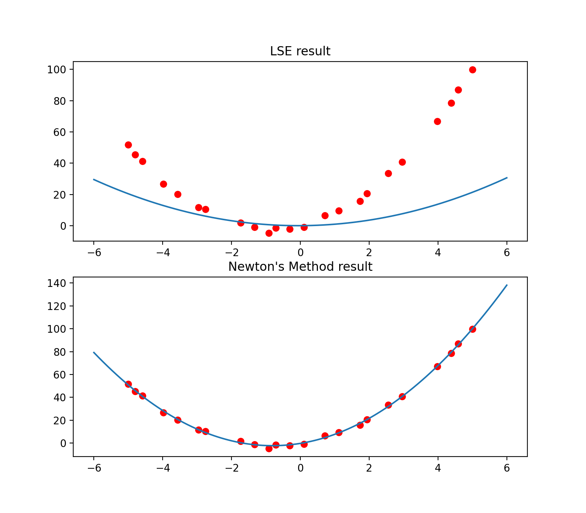

# Regularized Linear Model Regression

Code for ML homework#1. This is a program that can do regularized (polynomial basis) and visulaize the result. I used two method: lse and Newton's method.

## Table of Contents

- [Regularized Linear Model Regression](#regularized-linear-model-regression)
  * [Table of Contents](#table-of-contents)
  * [What does it do?](#what-does-it-do-)
  * [Usage](#usage)
    + [Preqs](#preqs)
    + [Data](#data)
    + [Applying HW1](#applying-hw1)

## What does it do?

Given data points (x,y), the number of polynomial basis, and the regularization term, this program can predict the data points' function curve by both lse and Newton's method and visualize the result.



## Usage

### Preqs

You will need a conda environment with Python=3.8

```
conda env create -n HW1 -f environment.yml
```

### Data

Sample data is provided in `testfile.txt`. You can create or import your own data, but you will need to modify `f=open('testfile.txt','r').readlines()` in `main.py`

### Applying HW1
```
python main.py
```


