# Naive Bayes Classifier and Online Learning

By [Zhi-Yi Chin](https://github.com/joycenerd)

This project surrounds MLE (Maximum Likelihood Estimation). The first part of the project is the Naive Bayes Classifier. We create a naive Bayes classifier for each handwritten digit that supports discrete (multinomial naive Bayes) and continuous (Gaussian naive Bayes) features. The data I use in this part is MNIST handwritten digit from [this](http://yann.lecun.com/exdb/mnist/) link. The second part of the project is Online Learning. In this part, We use online learning to learn the beta distribution parameter p of the coin tossing trails in batch. We use the conjugate prior property when the likelihood is binomial and prior is beta.

## Getting Started

This repository has all the code and data you need to replicate out results. But before you continue you will need a conda environment with Python>=3.7.

### 1. Clone the project

```
git clone \
  --depth 1  \
  --filter=blob:none  \
  --sparse \
  https://github.com/joycenerd/NCTU-ML_2021 \
;
cd NCTU-ML_2021
git sparse-checkout init --cone
git sparse-checkout set HW2
```

### 2. Create conda environment

```
conda env create -n MLE -f environment.yml
```

### 3. Execute the code

If you just want to replicate the results:
```
python naive_bayes_classifier.py
python online_learning.py
```
If you want to use your own data:

1. For **naive bayes classifier** you will need to modify the whole code file, but the structure will still be the same.
2. For **online learning**, you can swap `testfile.txt` to you own data, but remember your data should still be binomial (0,1).

## Results

### Imagination Numbers

<table border="5" bordercolor="red" align="center">
    <tr>
        <th>0</th>
        <th colspan="2">1</th>
        <th>2</th>
    </tr>
    <tr>
        <td>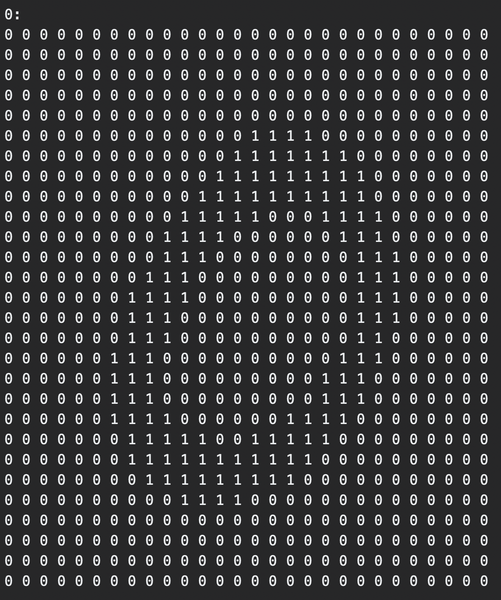</td>
        <td colspan="2">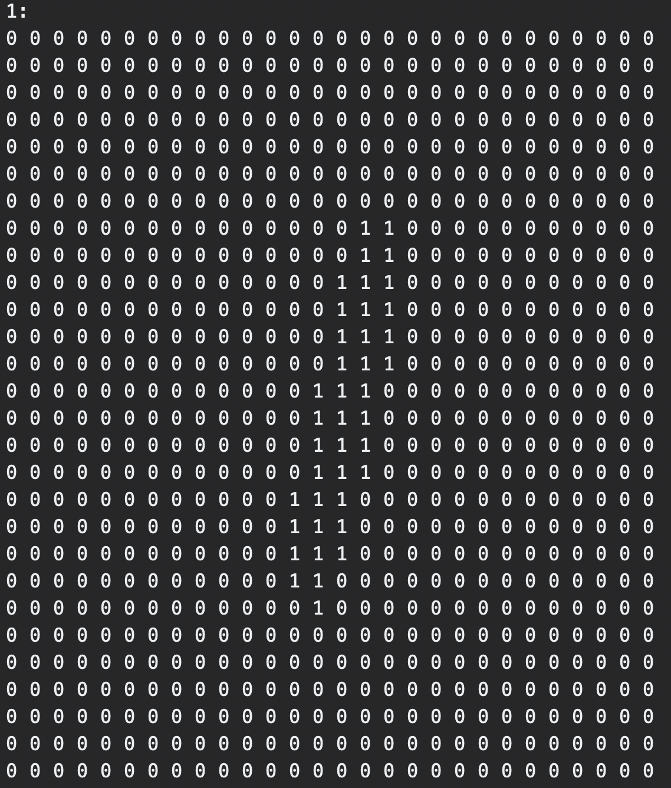</td>
        <td>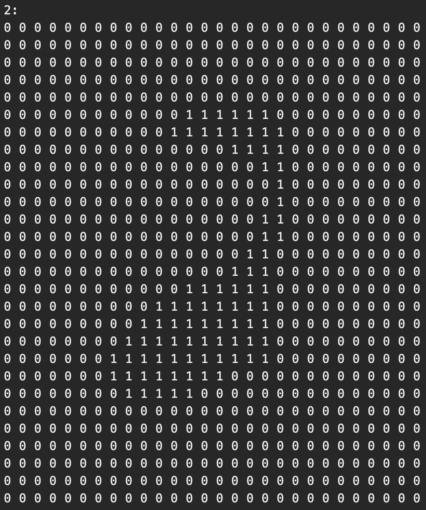</td>
    </tr>
    <tr>
        <th>3</th>
        <th colspan="2">4</th>
        <th>5</th>
    </tr>
    <tr>
        <td>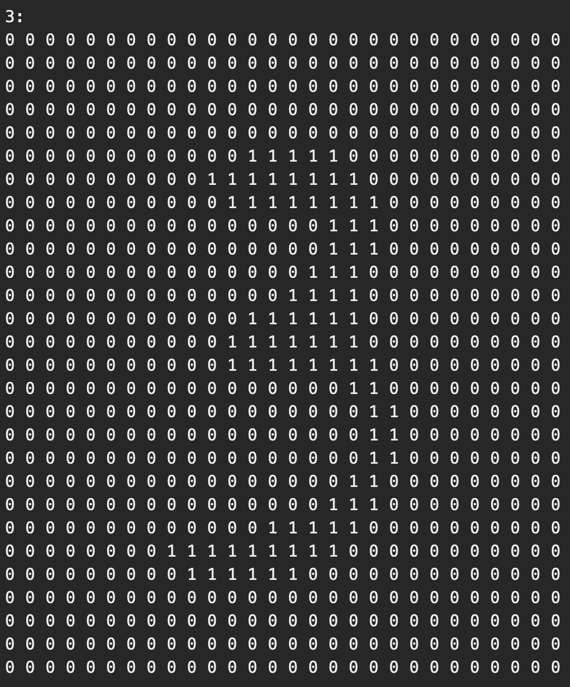</td>
        <td colspan="2">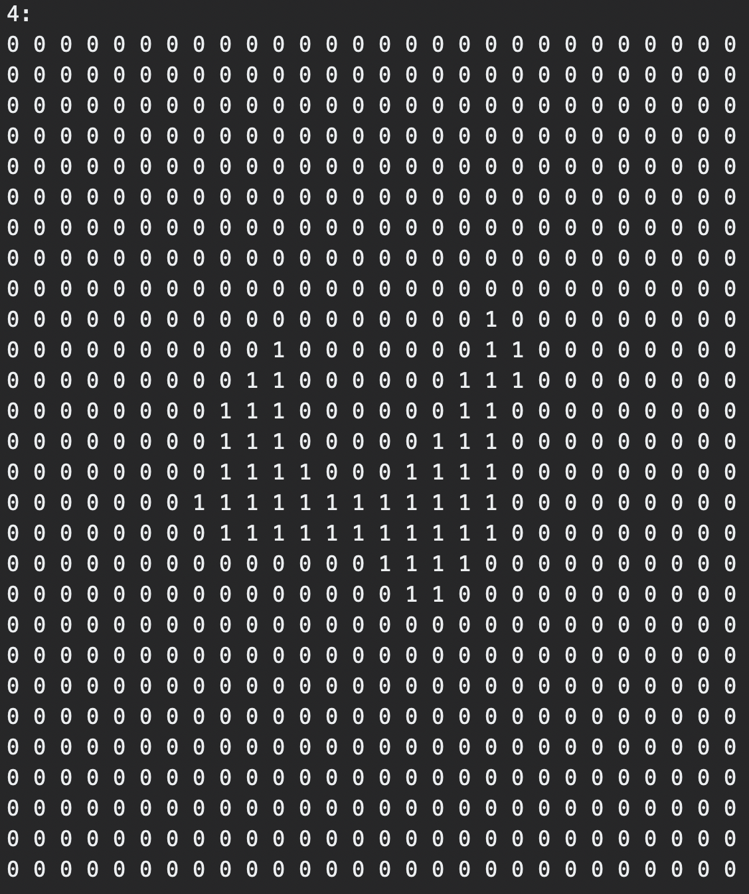</td>
        <td>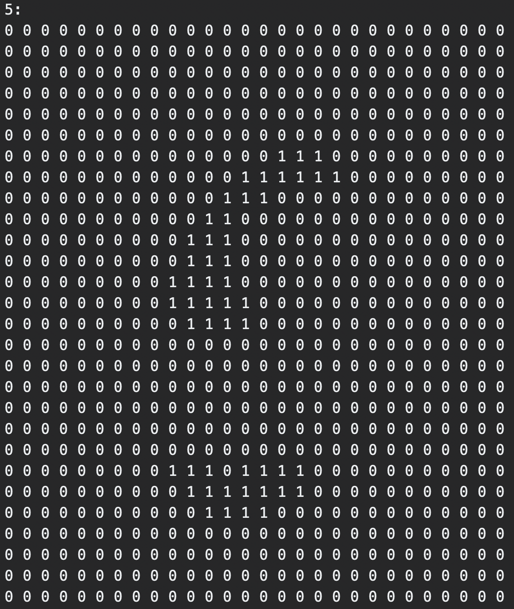</td>
    </tr>
    <tr>
        <th>6</th>
        <th colspan="2">7</th>
        <th>8</th>
    </tr>
    <tr>
        <td>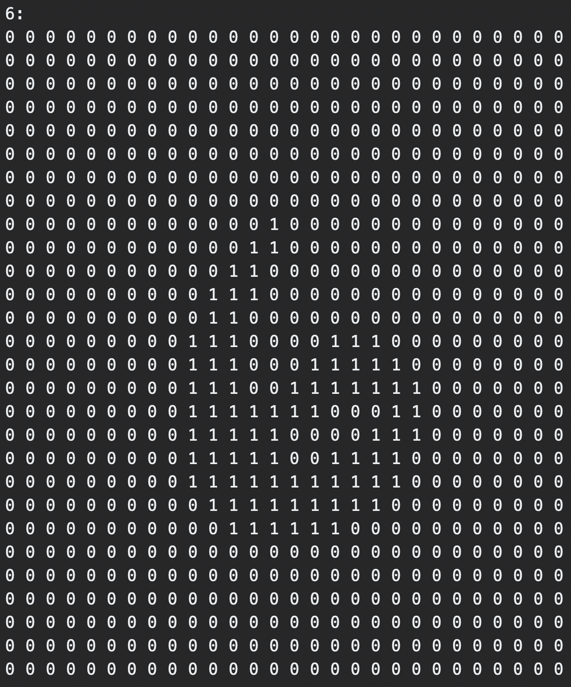</td>
        <td colspan="2">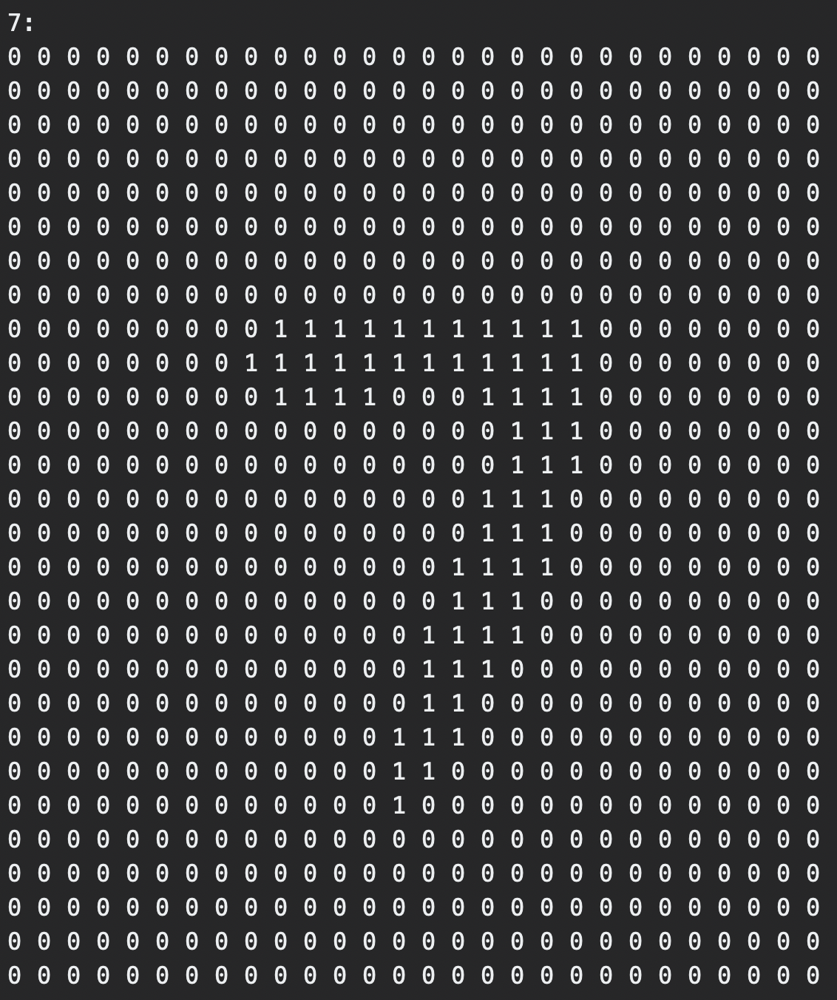</td>
        <td>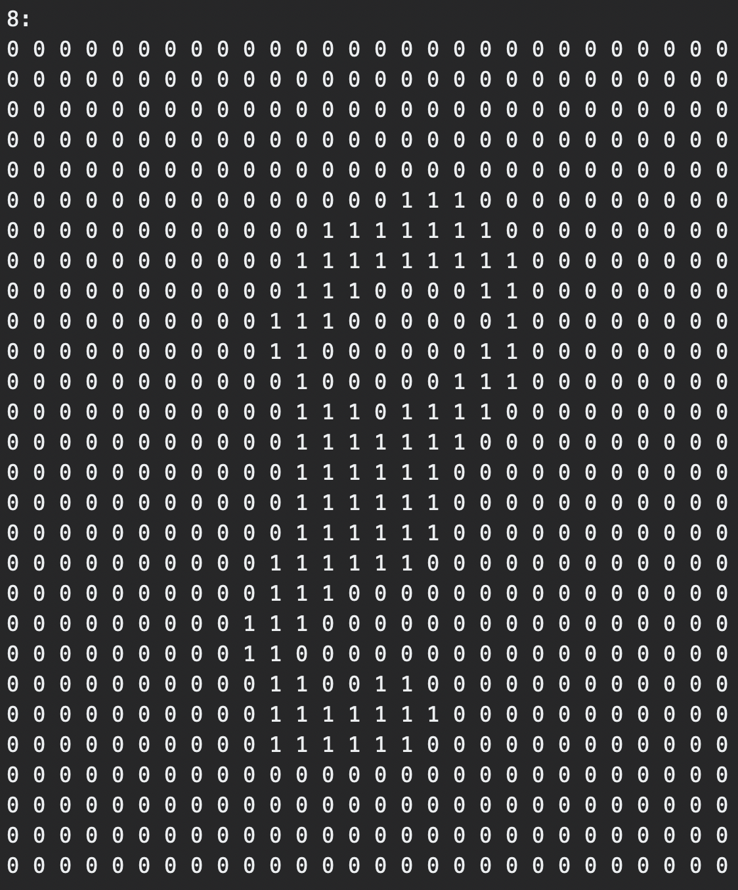</td>
    </tr>
    <tr>
        <td colspan="2">9</td>
        <td colspan="2">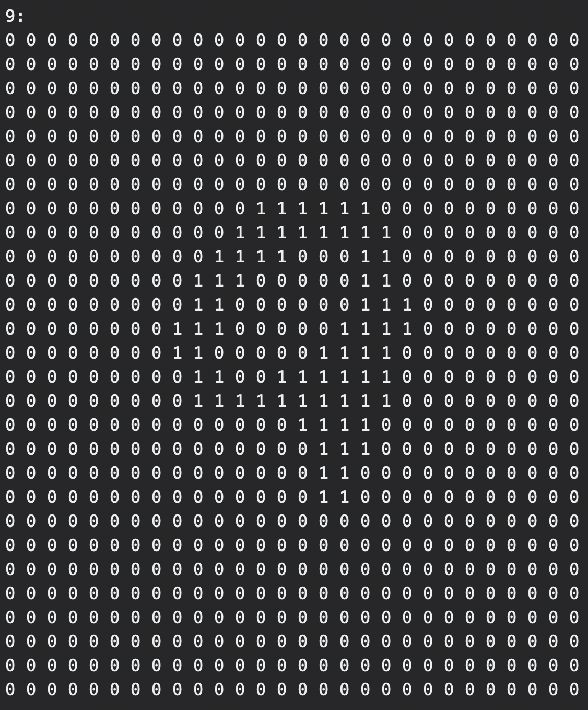</td>
    </tr>
</table>

### Error rates for naive bayes classifier

<table border="5" align="center">
    <tr>
        <th>Discrete</th>
        <th>Continuous</th>
    </tr>
    <tr>
        <td>15.18%</td>
        <td>18.5%</td>
    </tr>
</table>

### Online learning conjugate prior

<table border="5" align="center">
    <tr>
        <th>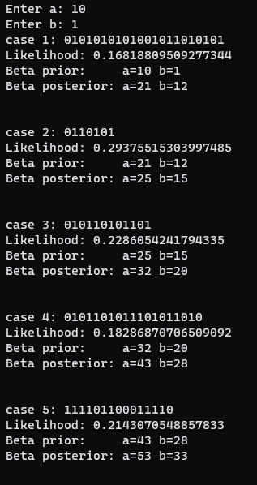</th>
        <th>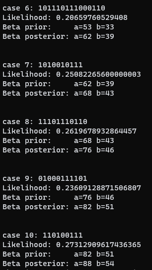</th>
    </tr>
</table>

### Sample plots for online learning

* m=N=1
* 

<table border="5" align="center" width="100%">
    <tr>
        <th>Prior  ()</th>
        <th>Likelihood (0.5)</th>
        <th>Posterior ()</th>
    </tr>
    <tr>
        <td colspan="3">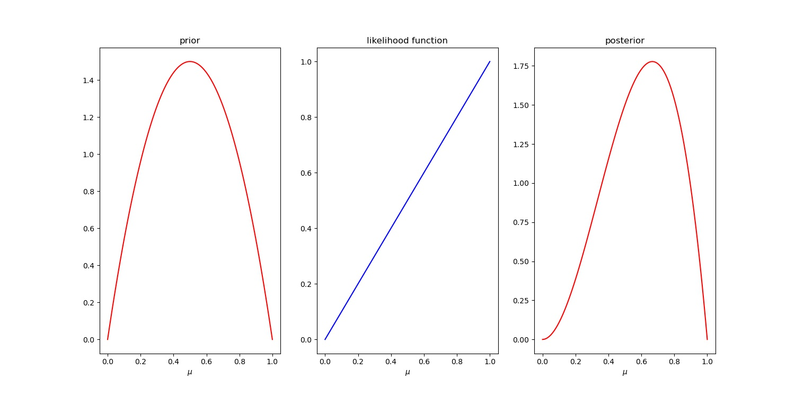</td>
    </tr>
</table>

