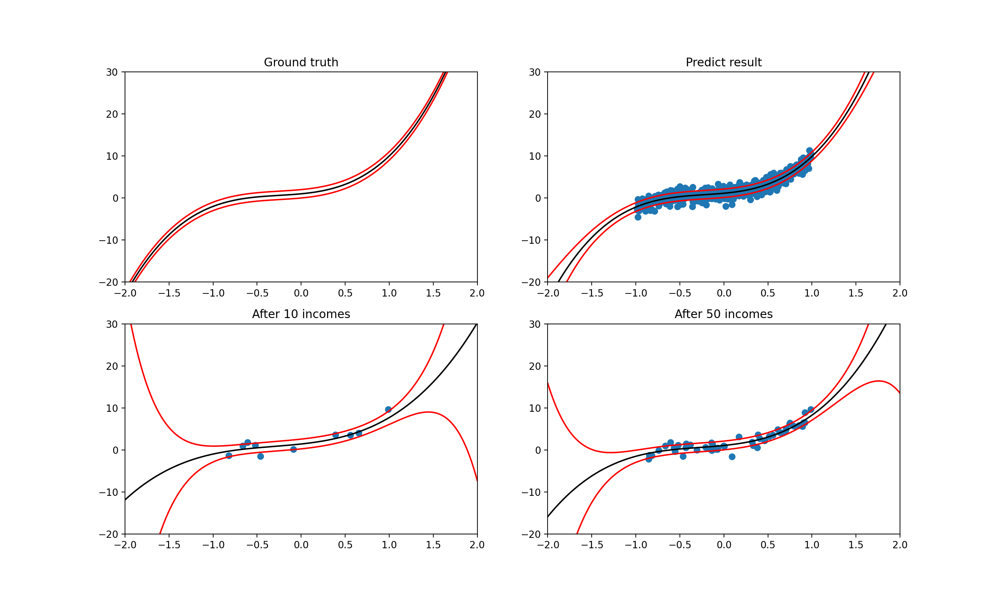

# Bayesian Linear Regression

This project splits into three parts. The first part is a random data generator. In this part, we generate data from normal distribution by giving mean and variance without calling `np. normal()`. Then we implement a polynomial basis linear model generator, which from the given weights and random x (uniform distribution) and small error generate from a normal distribution, we get out y. The second part is the sequential estimator. In this part, we use the Gaussian data generator from the first part to keep generating data; then, we sequentially estimate the mean and variance until the estimate converges. The third part is the most important Bayesian linear regression. In this part, given initial prior (Gaussian), using Bayesian linear regression to update the posterior and predictive distribution until the predictive distribution converges.

## Dependency

The project is tested in conda environment with Python3, the dependencies includes:
* numpy
* matplotlib

```
conda env create -f environment.yml
conda activate Bayesian
```

## Execute the codes

```
python random_data_generator.py
python sequential_estimator.py
python Bayesian_data_generator.py
```

## Results

