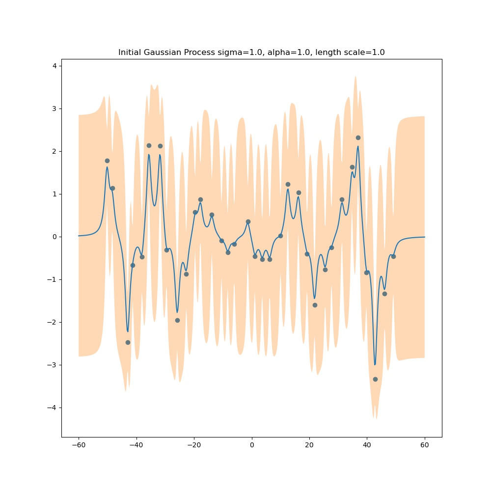
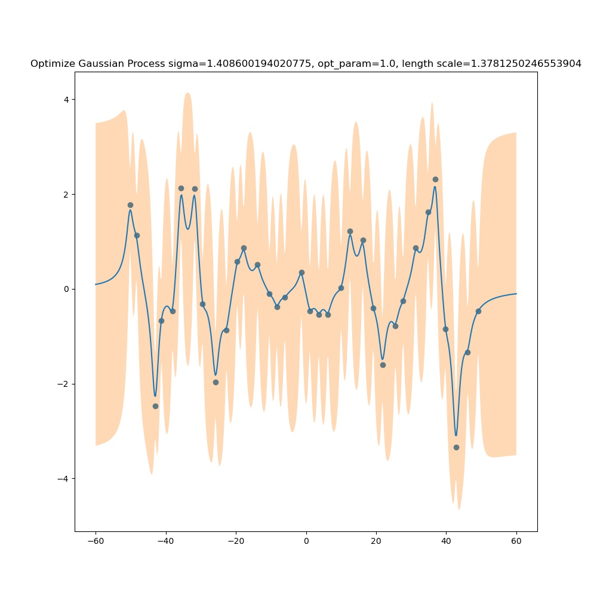
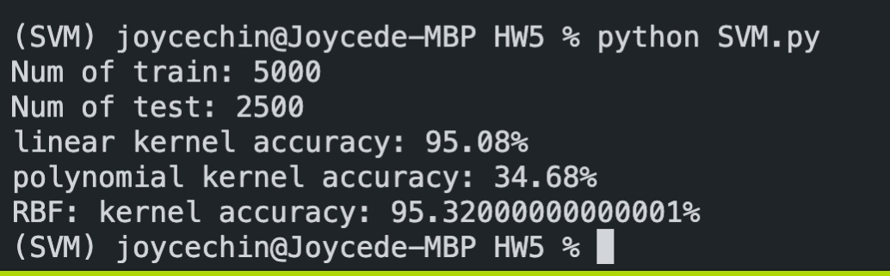
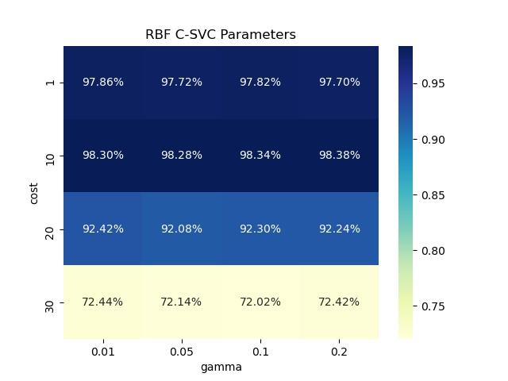
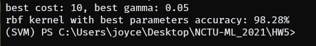
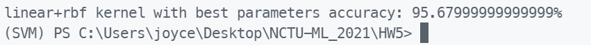

# Gaussian Process & SVM

Implementation of Gaussian Process and SVM (both used kernel tricks)

## Set up the environment

You should have Anaconda or Miniconda installed with Python>=3.7

```
conda env create -f environment.yml
conda activate SVM
```

## Reproducing the experiments

```
python gaussian_process.py
```



```
python SVM.py --part 1
```


```
python SVM.py --part 2 --kernel-type rbf
```



```
python SVM.py --part 3
```


