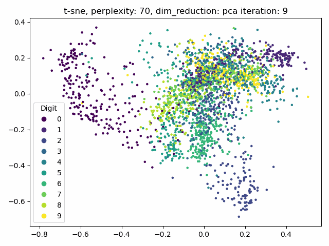
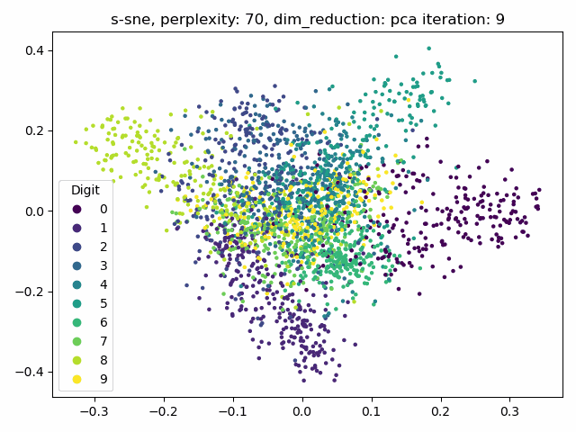

# Kernel Eigenface and t-SNE

## What is dimensionality reduction?

Dimensionality reduction, or dimension reduction, is transforming data from a high-dimensional space into a low-dimensional space so that the low-dimensional representation retains some meaningful properties of the original data, ideally close to its intrinsic dimension. Working in high-dimensional spaces can be undesirable for many reasons; raw data are often sparse due to the curse of dimensionality, and analyzing the data is usually computationally intractable. Therefore, dimensionality reduction is expected in fields with large numbers of observations and/or large numbers of variables, such as signal processing, speech recognition, neuroinformatics, and bioinformatics.

## What is t-SNE?

t-distributed stochastic neighbor embedding (t-SNE) is a statistical method for visualizing high-dimensional data by giving each datapoint a location in a two or three-dimensional map. It is based on Stochastic Neighbor Embedding initially developed by Sam Roweis and Geoffrey Hinton, where Laurens van der Maaten proposed the t-distributed variant. Thus, a nonlinear dimensionality reduction technique is well-suited for embedding high-dimensional data for visualization in a low-dimensional space of two or three dimensions. Precisely, it models each high-dimensional object by a two- or three-dimensional point so that similar objects are modeled by nearby points and distant points with high probability model different objects.

## Dependencies

* pillow
* numpy
* matplotlib
* scipy

## Running this project

```
conda env create -f environment.yml
conda activate PCA
```
Download [Yale Face Database](http://vision.ucsd.edu/content/yale-face-database) and save that in this project and modified the `DATA_PATH` in `kernel_eigenface.py` to the path you save the data.

```
python kernel_eigenface.py
python t-SNE.py
```

## Experimental Results

### Accuracy of face recognition

| Original            |         |         |         |         |         |         |
| ------------------- | ------- | ------- | ------- | ------- | ------- | ------- |
| K                   | 1       | 3       | 5       | 7       | 9       | 11      |
| Accuracy            | 0.8333  | 0.8333  | 0.8667  | 0.8     | 0.8     | 0.8     |
|                     |         |         |         |         |         |         |
| PCA                 |         |         |         |         |         |         |
|                     | 1       | 3       | 5       | 7       | 9       | 11      |
| None                | 0.8333  | 0.8667  | 0.9     | 0.9     | 0.8333  | 0.8     |
| linear              | 0.2     | 0.1     | 0.06667 | 0.06667 | 0.06667 | 0.03333 |
| polynomial (5,1,2)  | 0.2333  | 0.2667  | 0.2333  | 0.2667  | 0.2     | 0.2667  |
| rbf (1e-7)          | 0.8     | 0.8     | 0.7667  | 0.8     | 0.8     | 0.8     |
|                     |         |         |         |         |         |         |
| LDA                 |         |         |         |         |         |         |
|                     | 1       | 3       | 5       | 7       | 9       | 11      |
| None                | 0.7667  | 0.7     | 0.7     | 0.7333  | 0.6333  | 0.6     |
| linear              | 0.03333 | 0.03333 | 0.06667 | 0.06667 | 0       | 0       |
| polynomial (1,2,20) | 0.1333  | 0.2     | 0.1     | 0.06667 | 0.1     | 0.1     |
| rbf                 | 0.1     | 0.03333 | 0.03333 | 0       | 0.03333 | 0.03333 |

### SNE error rates

| t-sne |        |        |        |
| ----- | ------ | ------ | ------ |
|       | 30     | 50     | 70     |
| pca   | 0.9789 | 0.9147 | 0.8715 |
| lda   | 1.3994 | 1.3339 | 1.2751 |
|       |        |        |        |
| s-sne |        |        |        |
|       | 30     | 50     | 70     |
| pca   | 1.9766 | 1.8831 | 1.6821 |
| lda   | 2.4524 | 2.1585 | 1.9598 |

### t-SNE results



### s-SNE results


